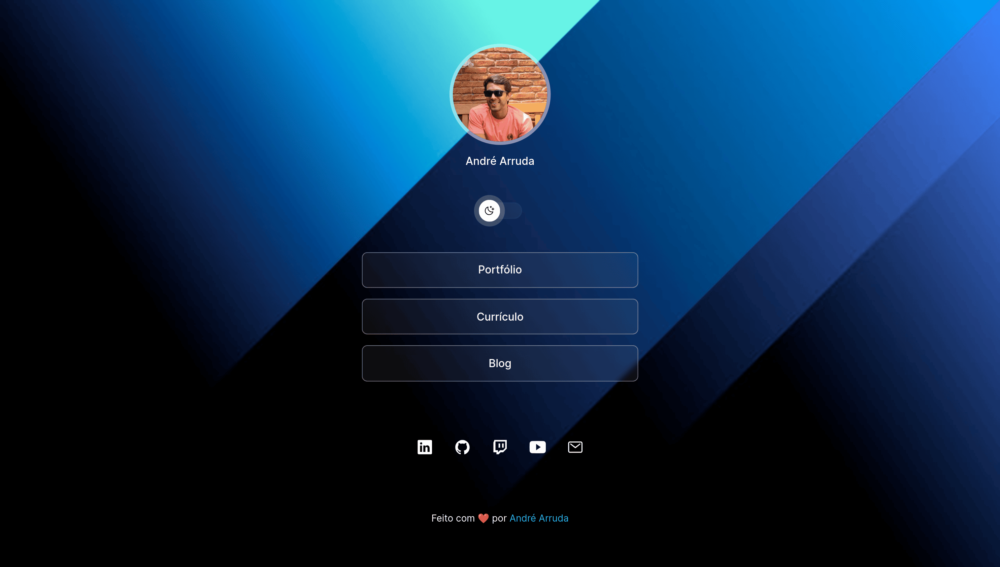
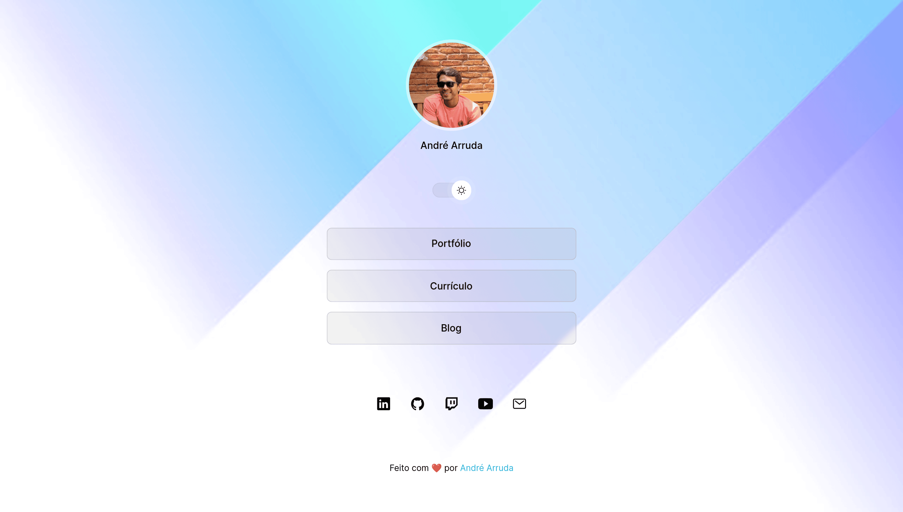
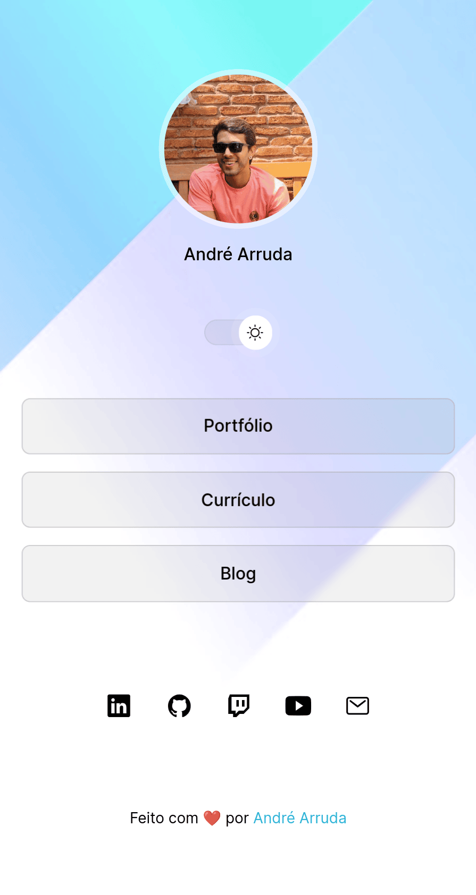

<h1 align="center">
    
</h1>

<h1 align="center">
    Devlinks
</h1>

<p align="center">
	<a href="#-tecnologias">Tecnologias</a>&nbsp;&nbsp;&nbsp;|&nbsp;&nbsp;&nbsp;
	<a href="#-projeto">Projeto</a>&nbsp;&nbsp;&nbsp;|&nbsp;&nbsp;&nbsp;
	<a href="#instalação">Instalação</a>&nbsp;&nbsp;&nbsp;|&nbsp;&nbsp;&nbsp;
	<a href="#instalação">Exemplo</a>
</p>

## 🚀 Tecnologias
Esse projeto foi desenvolvido com as seguintes tecnologias:
- HTML e CSS
- JavaScript
- Git e GitHub


## 💻 Projeto
**Agregador de links para uso como cartão de visita online 🚀**

## Instalação
```sh
# clonar repositório
git clone https://github.com/andre23arruda/devlinks
```
- Abrir __devlinks/index.html__


## Exemplo
<div align="center">
    
    
</div>
<hr>

<div align="center">
  
  
</div>
<hr>
